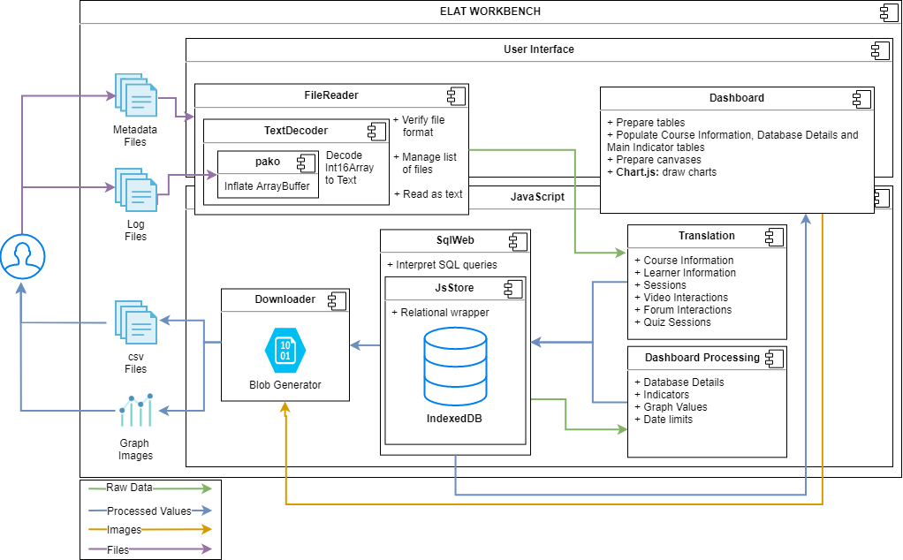

# ELAT - EdX Log Analysis Tool
Self-contained, web-based tool to process **edX course** logs into a database for analysis,
allowing to generate and download structured files (csv), reports and visualizations.
Ongoing project from the Web Information Systems Group and Delft Data Science Initiative of the
Delft University of Technology. 
Please visit the [website](https://mvallet91.github.io/ELAT/) for more info.

### Architecture Draft

#### Requirements

- Web application: fully client-side - platform agnostic

- Persistent database: stored in IndexedDB, locally, in path such as 
_%LocalAppData%\Google\Chrome\User Data\Default\Local Storage_

- Input: edX metadata files, edX daily log files in gzip format, as obtained from the institution's 
[_data czar_](https://edx.readthedocs.io/projects/devdata/en/stable/internal_data_formats/data_czar.html), 
who in turn obtains everything from edX

- Outputs: csv files (one for each table - sessions, video_interactions, quiz_sessions, etc.), quick indicators
and metrics, insight graphs. 

#### Development Choices/Challenges

- Website deployment

    - Currently GitHub Pages

- Uploading files to browser using [FileReader](https://developer.mozilla.org/en-US/docs/Web/API/FileReader) 

    - In gzip format, as obtained from Data Czar/edX
        
- Local processing

    - **efficient?** Good enough!
    
    - **JS vs Python = translate or transpile** Definitely translate to JS (Python-in-the-browser was more than 200 times slower!)

- Translation Script: Python vs JavaScript

    - **Winner** Use [Transcrypt](https://www.transcrypt.org/) or [Javascripthon](https://pypi.org/project/javascripthon/) to transform the *translation* module from Python to JavaScript, correct, adapt and add I/O modules
        
    - **Runner-up** Use [Brython](https://www.brython.info/index.html) to run the *translation* module in Python in the browser and handle I/O with JavaScript
    
    - **Not necessary** Write from scratch in JavaScript 

- Database Tools

    - [JsStore](https://github.com/ujjwalguptaofficial/JsStore) + [SQLWeb](https://github.com/ujjwalguptaofficial/sqlweb) + [IndexedDB](https://developer.mozilla.org/en-US/docs/Web/API/IndexedDB_API) SQLWeb parses regular SQL queries into api calls for JsStore, which is an SQL-focused wrapper for IndexedDB, a local key-value store in most modern browsers. Might be problematic when adding new rows from logs, and for the metrics queries (especially JOINS) already created in SQL.  
    
# Citing
If you use ELAT, or adapt it for your work, please cite our (preprint) publication [edX Log Data Analysis Made Easy](https://chauff.github.io/documents/publications/LAK2020-Torre.pdf) 
<pre><code>@inproceedings{Valle2020ELAT,
 author = {Valle Torre, Manuel and Tan, Esther and Hauff, Claudia},
 title = {edX Log Data Analysis Made Easy},
 booktitle = {Proceedings of the 10th International Conference on Learning Analytics \& Knowledge},
 series = {LAK20},
 year = {2020},
 location = {Frankfurt, Germany}
} 
</code></pre>
